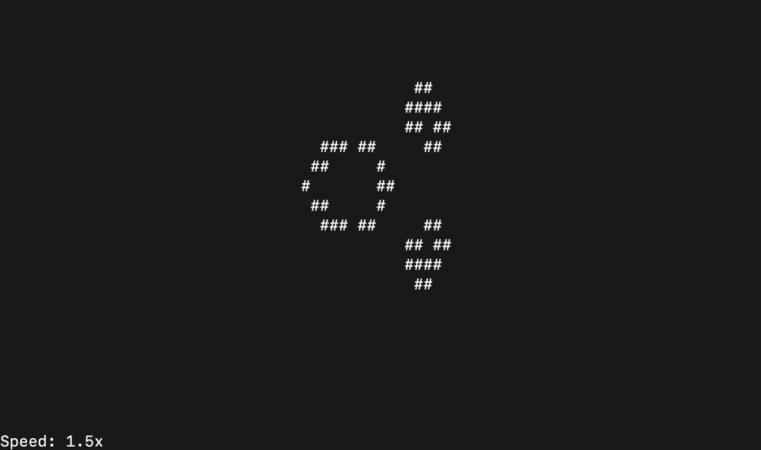

# The-Game-of-Life

## Description

* The playing field - a rectangle of 80 by 25 cells – as a matrix of the state of the "game". 

* The field is "closed to itself", for example, in the lower right square, the neighbor on the right is the lower left square, and the neighbor on the bottom is the upper right.

* Original initialization of the "game" state via stdin or text files with initial states for quick launch and initialization through input redirection. 

### Keys:

* Z/X - to change the simulation speed

* Space Bar - pause

## Important notes

* The game is written in C, has a structured style, and is run from the terminal
  
* The source code has been tested by the static analyzer `cppcheck`, as well as the style linter `cpplint`

* No dynamic memory was used

* In developing the game, the principles of structured programming by E. Dijkstra were followed
